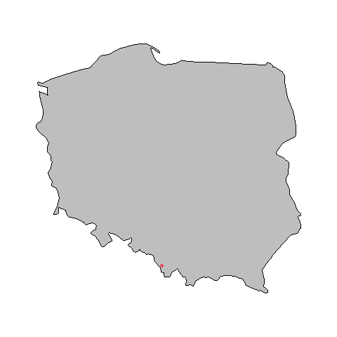

```{r setup, include=FALSE}
knitr::opts_chunk$set(echo = TRUE)
setwd("~/Wisla")
getwd()
library(tidyr)
library(gamlss)
library(maps)
library(fitdistrplus)
```

```{r load Wisla, include=FALSE}
load(file="Wisla.Rdata")
```

## Cel

Głównym celem pracy jest analiza 20 i 50 letnich poziomów zwrotu dla sezonu letniego. Wykorzystano 3 różne sposoby estymacji:

1.  Biblioteka gamlss
2.  Metoda maksimów blokowych
3.  Metoda przekroczenia progu

## Stacja

Dane do analizy pochodzą ze stacji w mieście Wisła. Kod stacji to "X249180230". Stacja znajduje się na długości geograficznej 18.86139°, szerokości geograficznej 49.65472° i wysokości 430m nad poziomem morza. Miasto znajduje się w województwie śląskim, w powiecie cieszyńskim przy południowej granicy Polski.



## Dane

Dane do analizy pochodzą ze zbioru pomiarów od 2008 do 2018 wykonywanych co 10 minut. Każdy pomiar jest oznaczony datą i godziną i wyrażony jest w stopniach celsjusza.

## Biblioteka gamlss

Biblioteka gamlss implementuje funkcje dopasowujące parametry dla rozkładów prawdopodobieństwa. Umożliwia ona znalezienie właściwego rozkładu do danych i oszacowanie poziomów zwrotu.

```{r echo=TRUE, warning=FALSE, message=FALSE}

library(gamlss)
```

Funkcją fitDist dopasowujemy odpowiedni model do danych.

```{r}
fit = fitDist(max10$max10, k = 2, type="realline")
```

Najlepszy rozkład znaleziony przez powyższą funkcję dla danych ze stacji Wisła to `SEP1` - `The Skew Power exponential type 1-4 distribution for fitting a GAMLSS`Funkcja gęstości prawdopodobieństwa dla rozkładu ma 4 parametry:

$\mu, \space \sigma, \space \nu, \space \tau$. $\mu$ i $\sigma$ odpowiadają położeniu i skali rozkładu. Parametr $\nu$ określa lewy ogon rozkładu z $\tau > 1$ wkazującym na "lżejszy" ogon i $\tau < 1$ wkazującym na "cięższy" ogon. Parametr $\tau$ określa prawy ogon rozkładu w ten sam sposób co lewy. Funkcję można przedstawić za pomocą wzoru: $$
f(y|\mu, \sigma, \nu, \tau) = \frac{c}{\sqrt{2\pi}\sigma(1 + z^{2})^{1/2}}e^{-r^{2}/2}
$$

## Metoda maksimów blokowych

Metoda maksimów blokowych polega na podzieleniu danych na bloki o równym rozmiarze, z których wyliczane są maksima. Maksima są następnie wykorzystywyane do olbiczania parametrów do funkcji gev().

### Biblioteka evir

Biblioteka evir służy do obliczania zdarzeń ekstremalnych. Zawiera funkcje takie jak GEV i GPD, które zostaną użyte do metody maksimów blokowych i metody przekroczenia progu.

### Rozkład GEV

$$
G(y) = \exp( -[ (y-\mu)/ \sigma ]_{+}^{- 1/ \xi})$$ gdzie $\sigma > 0$, $-\infty < \mu < \infty$ i $1 + \xi(y-\mu)/\sigma > 0$. Tutaj, $x_+ = \max(x,0)$\$
