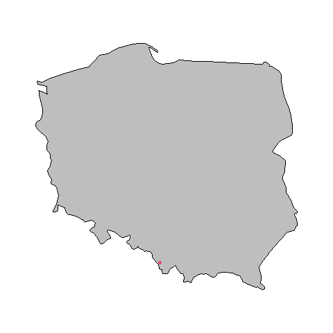
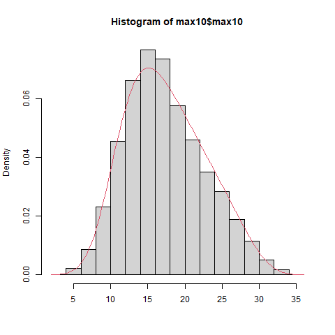

```{r setup, include=FALSE}
knitr::opts_chunk$set(echo = TRUE)
setwd("~/Wisla")
getwd()
library(tidyr)
library(gamlss)
library(maps)
library(fitdistrplus)
```

```{r load Wisla, include=FALSE}
load(file="Wisla.Rdata")
```

## Cel

Głównym celem pracy jest analiza 20 i 50 letnich poziomów zwrotu dla sezonu letniego. Wykorzystano 3 różne sposoby estymacji:

1.  Biblioteka gamlss
2.  Metoda maksimów blokowych
3.  Metoda przekroczenia progu

## Stacja

Dane do analizy pochodzą ze stacji w mieście Wisła. Kod stacji to "X249180230". Stacja znajduje się na długości geograficznej 18.86139°, szerokości geograficznej 49.65472° i wysokości 430m nad poziomem morza. Miasto znajduje się w województwie śląskim, w powiecie cieszyńskim przy południowej granicy Polski.



## Dane

Dane do analizy pochodzą ze zbioru pomiarów od 2008 do 2018 wykonywanych co 10 minut. Każdy pomiar jest oznaczony datą i godziną i wyrażony jest w stopniach celsjusza.

## Biblioteka gamlss

Biblioteka gamlss implementuje funkcje dopasowujące parametry dla rozkładów prawdopodobieństwa. Umożliwia ona znalezienie właściwego rozkładu do danych i oszacowanie poziomów zwrotu.

```{r echo=TRUE, warning=FALSE, message=FALSE}

library(gamlss)
```

Funkcją fitDist dopasowujemy odpowiedni model do danych.

``` r
fit = fitDist(max10$max10, k = 2, type="realline")
```

Najlepszy rozkład znaleziony przez powyższą funkcję dla danych ze stacji Wisła to `SEP1` - `The Skew Power exponential (SEP) distribution for fitting a GAMLSS.`



Jak widać na histogramie rozkład jest bardzo dokładny.

Funkcja gęstości prawdopodobieństwa dla rozkładu ma 4 parametry: `mu`, `sigma`, `nu`, `tau`.

`mu` i `sigma` odpowiadają położeniu i skali rozkładu. Parametr `nu` określa lewy ogon rozkładu. Parametr `tau` określa prawy ogon rozkładu. Funkcję można przedstawić za pomocą wzoru: $$f(y \mid n, \mu, \sigma \nu, \tau)==\frac{z}{\sigma} \Phi(\omega) f_{E P}(z, 0,1, \tau)$$dla $-\infty<y<\infty, \mu=(-\infty,+\infty), \sigma>0, \nu=(-\infty,+\infty)$ and $\tau>0$. gdzie $z=\frac{y-\mu}{\sigma}$, $\omega=\operatorname{sign}(z)|z|^{\tau / 2} \nu \sqrt{2 / \tau}$ and $f_{E P}(z, 0,1, \tau)$\$

Używając funkcji rozkładu `SEP1` uzyskujemy następujące poziomy zwrotu dla lata:

    x20 <- 1-(1/(20*92*24*6))
    result20 <- qSEP1(x20,mu,sigma,nu,tau); result20
    [1] 36.32214
    x50 <- 1-(1/(50*92*24*6))
    result50 <- qSEP1(x50,mu,sigma,nu,tau); result50
    [1] 36.72633
